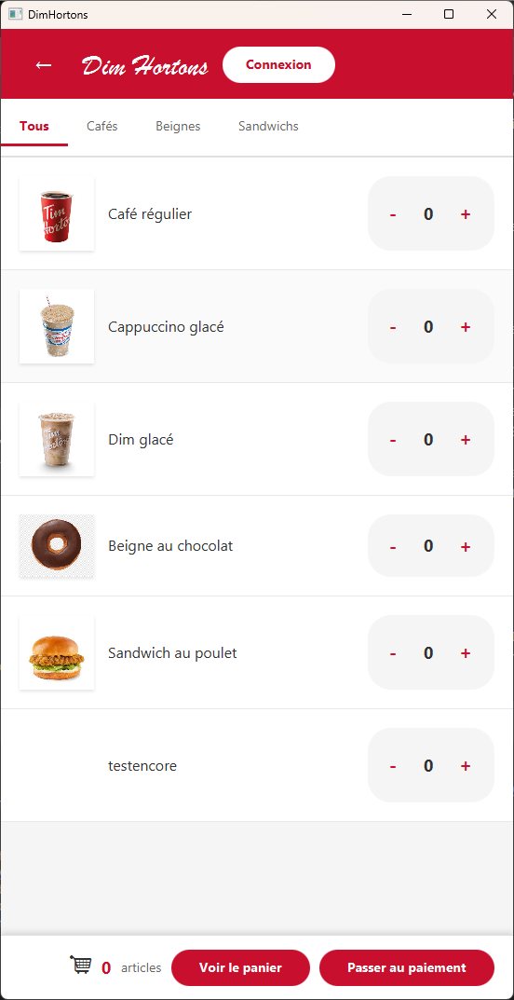
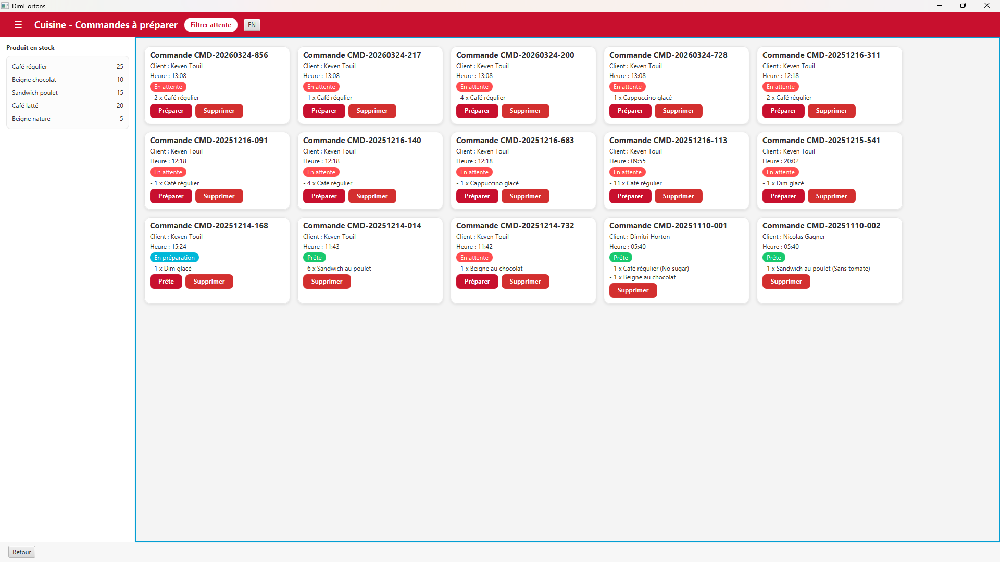
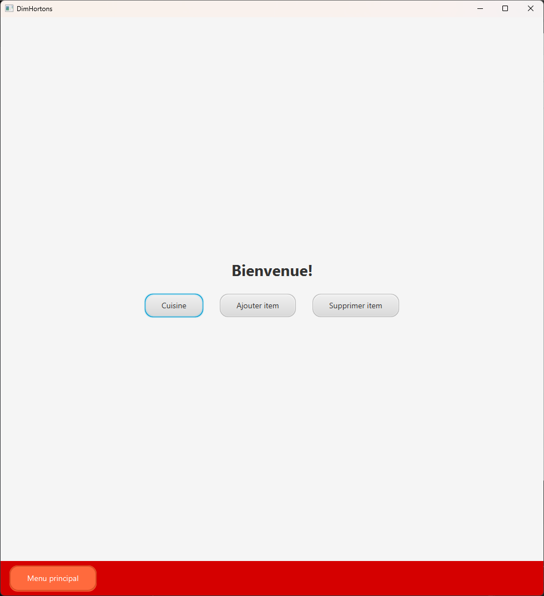
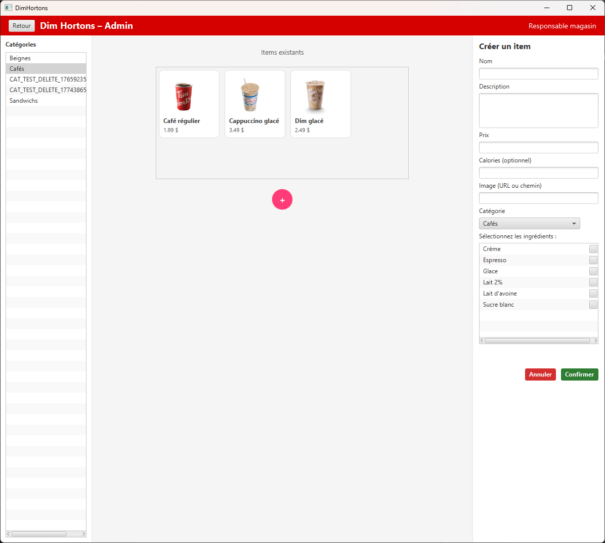

# ☕ DimHortons


> 🇫🇷 Application JavaFX de gestion de commandes pour restaurant, avec interface cuisine et administration.
>
> 🇬🇧 JavaFX restaurant order management application with kitchen and admin interfaces.

---

## 👥 Auteurs / Authors

| Nom / Name | Contribution |
|---|---|
| **Léandre Kanmegne** | Kitchen order management interface · Admin item management · Unit tests |
| Justin Chaput | Menu & cart |
| Nathan Grondin | User login & Payment processing |
| Rachid Touil | Modify Menu and delete items |

**Version:** 0.0.31 · **Date:** December 15, 2025

---

## 📸 Aperçu / Preview

<p float="left">
  
  
  
  
</p>

## 📖 Description

### 🇫🇷 Français

Application académique développée dans le cadre du cours de **Programmation orientée objet** au Cégep de Victoriaville. Elle permet de gérer les commandes d'un restaurant fictif : navigation dans le menu, gestion du panier, paiement, interface cuisine et administration.

### 🇬🇧 English

Academic project built for the **Object-Oriented Programming** course at Cégep de Victoriaville. It manages orders for a fictional restaurant: menu browsing, cart management, payment processing, kitchen view and admin panel.

---

## ✨ Fonctionnalités / Features

| 🇫🇷 | 🇬🇧 |
|---|---|
| 🍩 Parcourir le menu par catégorie | 🍩 Browse menu by category |
| 🛒 Ajouter/retirer des items, modifier les extras | 🛒 Add/remove items, customize extras |
| 💳 Paiement et confirmation de commande | 💳 Payment and order confirmation |
| 👨‍🍳 Gestion des commandes en cuisine (admin) | 👨‍🍳 Kitchen order management (admin) |
| ⚙️ Gestion du menu par l'administrateur (admin) | ⚙️ Menu management by administrator (admin) |
| 🔐 Authentification avec rôles (admin / cuisine) | 🔐 Role-based authentication (admin / kitchen) |
| 🧪 Tests unitaires par fonctionnalité | 🧪 Unit tests per feature |

---

## 🗂️ Structure

```
src/main/java/edu/cegepvicto/dimhortons/
├── Menu/               # Gestion du menu et panier / Menu & cart
├── Paiement/           # Traitement des paiements / Payment processing
├── Cuisine/            # Gestion des commandes / Order management  ← Léandre
├── Authentification/   # Connexion utilisateur / User login
└── Admin/              # Interface administrateur / Admin panel     ← Léandre
```

---

## ⚙️ Prérequis / Prerequisites

- ☕ JDK 25 ou supérieur / or higher
- 🔧 Gradle 7+
- 🗄️ MySQL — connexion par défaut / default connection: `root` / `mysql`
- 📄 Fichier `création.sql` pour initialiser la BD / to initialize the DB

---

## 🚀 Installation & Exécution / Setup & Run

```bash
# 1. Cloner / Clone
git clone https://github.com/Leandre02/Dim-Hortons.git
cd DimHortons

# 2. Initialiser la base de données / Initialize the database
# Exécuter / Run: création.sql

# 3. Compiler / Build
./gradlew build

# 4. Lancer / Run
./gradlew run
```

### 🔑 Compte de test / Test account
```
email : dimitri@dimhortons.ca
mdp / password : 1234
```

---

## 📚 Licence

Projet académique — Cégep de Victoriaville · Academic project